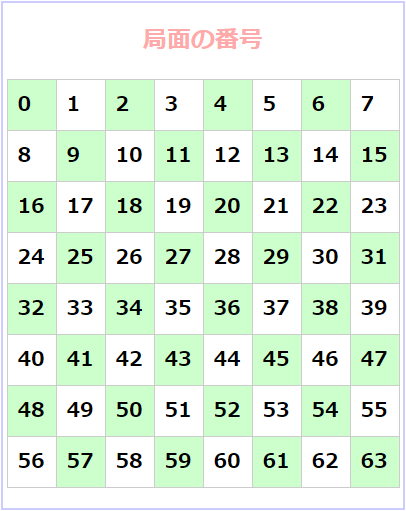

***
## 内部クラスとメソッド（クライアントプログラム/コントローラー側）
<table>
 <tr>
  <th>内部クラス</th>
 </tr>
 <tr>
  <th>ReceiveInvite</th><td>対局の申し込み（サーバーからの文字列）を受け取るスレッド  **マッチング画面で呼び出す** </td>
 </tr>
 <tr>
  <th>MatchReceive</th><td>対局中の操作（サーバーからの文字列）を受信するスレッド 対局画面で呼び出す</td>
 </tr>
 <tr>
  <th>メソッド<th>
 </tr>
　 
 <tr>
  <th>myPlayerRequest()</th><td>サーバー上の自分のPlayerオブジェクトをサーバーから受信する 成績参照などで呼び出す</td>
 </tr>
 <tr>
  <th>otherPlayerRequest()</th><td>サーバー上の他のPlayerオブジェクトのコレクションを持つListオブジェクトを受信する マッチング画面&対局待ちプレイヤーを更新するときに呼び出す</td>
 </tr>
 <tr>
  <th>startMatch()</th><td>対局中、自分の操作をサーバーに送るためのストリームをつくる 対局画面で呼び出す</td>
 </tr>
 <tr>
  <th>acceptOpponentOperation()</th><td>サーバーから送られてきた相手の操作（文字列）をOthelloオブジェクトに反映させる 対局中、サーバーから相手の操作を受信したとき呼び出す</td>
 </tr>
 <tr>
  <th>acceptMyOperation()</th><td>自分の操作をOhtelloオブジェクトに反映させる マスをクリックしたとき呼び出す（もしかしたら
  、いらないかも）</td>
 </tr>
</table>

***
## つくったクラスはパッケージothelloに入れること 
***
## フォルダー"*Source*"作りました。 
つくったソースはフォルダー"*Source*"直下に。 
途中のうまく動く段階で、『 othello_v1.java 』,『 othello_v2.java 』・・・ みたいに保存。 
動作テストとかのファイルがあれば、フォルダー"*Test*"に保存。
***
 
  <table>
    <tr>
      <th>議事録</th>
      <td>Hearing</td>
    </tr>
    <tr>
      <th>要求分析</th>
      <td>RequirementAnalysis</td>
    </tr>
    <tr>
      <th>設計</th>
      <td>Design</td>
    </tr>
    <tr>
     <th>ソースコード</th>
     <td>Source</td>
    </tr>
    <tr>
     <th>確認プログラム(Source直下)</th>
     <td>Test</td>
  </tr>
  </table>

<ul>
  <li>
    <table>
      <tr>
        <td></td>
        <td></td>
        <td></td>
        <td></td>
        <td></td>
        <td></td>
      </tr>
      <tr>
        <td>rgb(113,166,0)</td>
        <td>rgb(55,113,184)</td>
        <td>rgb(4,49,105)</td>
        <td>rgb(230,92,0)</td>
        <td>rgb(217,217,217)</td>
        <td>rgb(247,247,247)</td>
      </tr>
    </table> 
    
  </li>
</ul>

