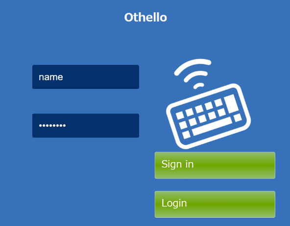

◆◆◆◆◆◆◆◆◆◆◆◆◆◆◆◆◆◆◆◆◆◆◆◆◆◆◆ 
つくったクラスはパッケージothelloに入れること 
◆◆◆◆◆◆◆◆◆◆◆◆◆◆◆◆◆◆◆◆◆◆◆◆◆◆◆ 
 
 
 
  <table>
    <tr>
      <th>議事録</th>
      <td>Hearing</td>
    </tr>
    <tr>
      <th>要求分析</th>
      <td>RequirementAnalysis</td>
    </tr>
    <tr>
      <th>設計</th>
      <td>Design</td>
    </tr>
  </table>

<ul>
  <li>
    <table>
      <tr>
        <td></td>
        <td></td>
        <td></td>
        <td></td>
        <td></td>
        <td></td>
      </tr>
      <tr>
        <td>rgb(113,166,0)</td>
        <td>rgb(55,113,184)</td>
        <td>rgb(4,49,105)</td>
        <td>rgb(230,92,0)</td>
        <td>rgb(217,217,217)</td>
        <td>rgb(247,247,247)</td>
      </tr>
    </table> 
    
  </li>
</ul>

